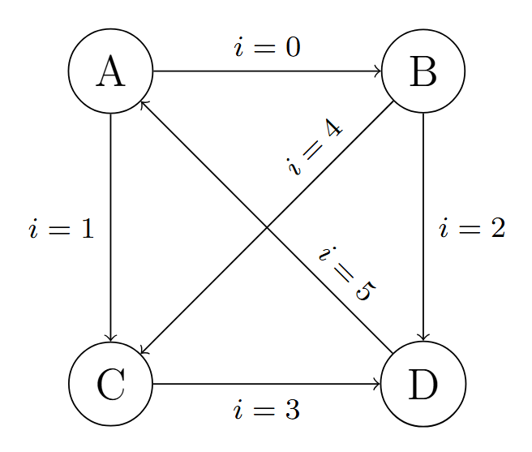

# embedded-c-exercises

This repository contains self-directed C programming exercises focused on embedded systems applications.

## State Machine

In `state_machine.c` the following state machine with 4 states is implemented:

where $i$ is the command line user input value.
